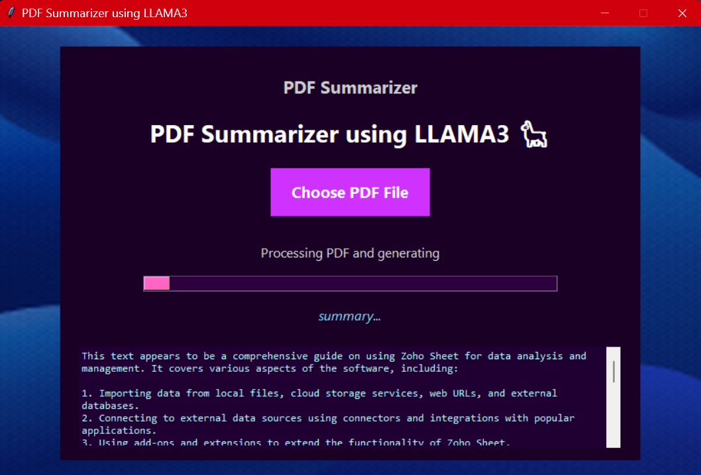

# AI-document-Summarizer
Capable of Summarizing any pdf document with word limit of 500-700 words 

A simple yet powerful desktop app built with **Tkinter**, **LangChain**, and **Ollama LLaMA3** that summarizes PDF files using a locally running LLaMA3 model. The app features a visually engaging UI with animated backgrounds and progress indicators for a smooth user experience.

---

## 🧠 Features

- 📄 Extracts text from any PDF file.
- 🦙 Generates concise and meaningful summaries using **LLaMA3 (via Ollama)**.
- 🎨 Beautiful GUI with animated GIF background.
- 🧵 Threaded processing for responsive UI.
- ✅ Visual feedback with progress bar and status messages.

---

## 📸 Screenshots



---

## 🗂️ Project Structure

```bash
.
├── backend.py      # Handles PDF text extraction and summary generation
├── GUI.py          # GUI implementation using Tkinter
├── background.gif  # Animated background for the UI
├── README.md       # You're reading it!
 ```
---

## 🚀 Getting Started

### 1. Clone this repo
### 2. Install Dependencies
- Ensure Python 3.8+ is installed. Then run:
  ```bash
  pip install -r requirements.txt
  ```
### 3. Install and Run Ollama
- Download and install Ollama. Then pull the LLaMA3 model:
```bash
ollama pull llama3.2:3b
```
- Make sure Ollama is running before you use the app.
### 4. Run the App
```bash
python GUI.py
```
---
## ⚙️ How It Works
### backend.py
- Uses PyMuPDF to extract text from PDF pages.
- Formats a prompt and sends it to the Ollama-powered LLaMA3 model using LangChain.
- Returns the summarized text.
### GUI.py
- Built using Tkinter and Pillow for GUI.
- Loads and animates a GIF background.
- Allows PDF file selection and invokes the backend in a separate thread to keep UI responsive.


